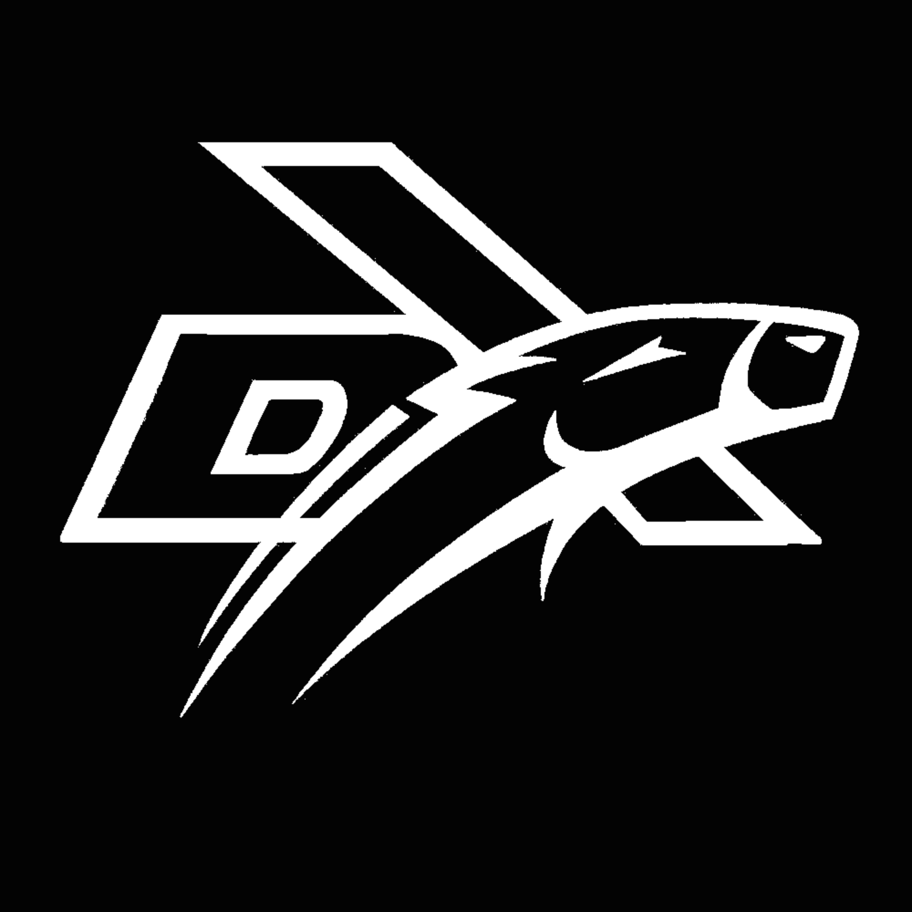

<h1 align="center">笃行 2026 雷达 </h1>

> 本仓库为西安交通大学笃行战队 RoboMaster 2026 赛季雷达代码，覆盖 1）视觉定位、2）无线电解调、3）激光反制控制、 4）兵种间通讯 四个模块。

<p align="center">
  
  
</p>

## 项目结构

```text
.
├── main.py                 # 命令行运行入口
├── main_event_loop.py      # 雷达站主事件循环与多线程状态聚合
├── config/                 # 比赛参数、模型路径、相机参数、地图关键点
├── RX/                     # GNU Radio 信息波/干扰波解调封装
├── driver/
│   ├── hik_camera/         # 海康工业相机封装
│   ├── motor/              # 激光云台底层控制工程
│   └── referee/            # 裁判系统串口协议与消息定义
├── tracker/                # 主相机目标检测、跟踪和卡尔曼滤波
├── transform/              # 像素坐标到赛场坐标的几何映射
├── lisar/                  # 激光检测模块识别、搜索策略和反制控制
│   ├── common/             # 反制通用组件
│   ├── easy/               # 基于传统视觉的检测方案
│   └── difficulty/         # 基于 YOLO26 的第三阶段检测方案
├── ui/                     # PyQt 雷达站监控界面
├── callibrate/             # 相机外参和地图点标定工具
├── model/                  # 模型封装与本地 YOLO26 代码
└── weights/                # TensorRT / PyTorch 模型权重
```

## 运行环境
### 硬件条件
- 主相机(广角): MV-CS200 +12mm镜头
- 副相机(长焦): MV-CE060-10UC + 50mm镜头
- 云台: 翎控6015
- PlutoSDR

| 上述硬件可根据自身情况替换，如电机品牌，我们也一并提供了其他电机(大疆、达妙)的底层驱动，由施辉翔贡献。

### 依赖 
- Ubuntu 22.04
- Python：3.10
- pyqt5
- GNU Radio

创建虚拟环境之后，首先安装所需基础 Python 依赖：

```bash
conda activate lidar
pip install -r requirements.txt
```

GNU Radio比较特殊，pip中无对应软件源，所以我们通过conda-forge配置:
```bash
conda install -c conda-forge gnuradio gnuradio-iio libiio libad9361-iio
```

| 由于我们采用上下位机通讯，须在工控机上配置同样环境。

## 快速启动

启动图形界面：

```bash
python -m ui.radar_monitor_window
```

## 模块化
我们为每个模块提供了便捷的单独测试脚本，比如：

- 单独启动解调调试(需连接PlutoSDR并修改RX/pluto.py中的SDR编号为你实际使用的SDR)：
```bash
# 可通过iio_info -s 查看SDR序列号
DEFAULT_SIGNAL_SERIAL = " " # 解信息波
DEFAULT_JAMMING_SERIAL = " " # 解干扰波
```

```bash
python -m RX.run_demod --side red --level base
```

- 单独运行第三阶段反制(需连接副相机、云台，并确认`config/params.yaml`中的`sub_camera`、`gimbal`和`stage3_detector`配置正确)：

```bash
# 使用副相机实时取流并控制云台
python -m lisar.difficulty.tracking_yolo26 --source sub --config config/params.yaml

# 使用录制视频离线调试检测效果；无云台版本
python -m lisar.difficulty.tracking_yolo26_without_gimbal --source video --video-path /path/to/video.mp4 --config config/params.yaml
```

- 单独跑视觉识别：

```bash
# 使用海康主相机实时识别
python -m tracker.detector --mode camera

# 使用视频离线调试
python -m tracker.detector --mode video --source /path/to/video.mp4
```

- 测试兵种间通讯(需连接服务器和裁判系统串口，默认`/dev/ttyUSB0`)：

```bash
# 按红方ID向英雄、工程、步兵、无人机、哨兵循环发送雷达状态消息
python -m driver.referee.test_referee_comm --faction red
```
