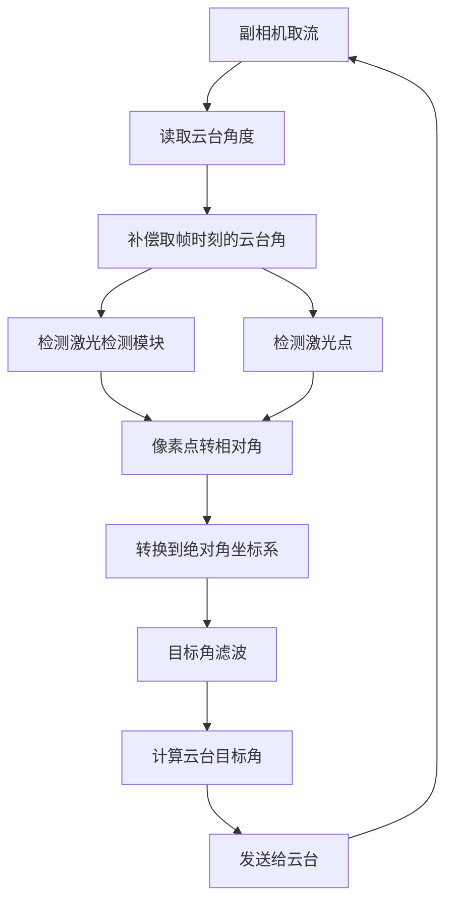

# 激光反制技术方案

这里是我们反制方案的具体技术文档。本文只描述核心方法：1) 如何从副相机图像中检测激光点与激光检测模块并计算目标角度，2) 如何在云台绝对角坐标系中完成稳定闭环控制。

## 总流程

反制问题的本质是：在图像中找到检测模块和激光点，并调整云台，使激光点落到检测模块中心。

## 绝对坐标系与相对角度

### 绝对坐标系的定义

我们把两个电机上电之后的初始位置记为绝对坐标系的零位, 
$$
\theta=(yaw=0,pitch=0).
$$
这个零位是通过事先设置电机的零位偏置使之刚好朝向正前方得到的。

后续我们做任何控制都要转换到这个绝对坐标系里，来排除云台自身运动的影响。

### 相对角度

设副相机图像中的任意像素点为
$$
p=(u,v).
$$

相机内参和畸变参数定义了一个映射

$$
g(p)=(\Delta\psi,\Delta\phi),
$$

其中 $\Delta\psi$ 是该像素相对相机光轴的 yaw 角，$\Delta\phi$ 是相对相机光轴的 pitch 角。这个映射来自针孔相机模型：像素点先去畸变，再由焦距归一化为一条空间光线，最后取反正切得到角度。

云台在取帧时刻的绝对角记为

$$
\theta=(\psi,\phi).
$$

则像素点 $p$ 对应的绝对角为

$$
A(p)=\theta+g(p).
$$

后续统一使用以下符号：

- $p_m$：检测模块中心像素点。
- $p_l$：激光点中心像素点。
- $A_m=A(p_m)$：检测模块中心的绝对角。
- $A_l=A(p_l)$：激光点的绝对角。

因此反制闭环的目标不是让 $p_m$ 落在图像中心，而是让

$$
A_l \rightarrow A_m.
$$

## 补偿

运行过程中，图像帧和云台角度不是完全同时获得的。若当前读取到的云台角为 $\theta_t$，角速度为 $\dot{\theta}$，图像延迟为 $\tau$，则取帧时刻的云台角近似为
$$
\theta=\theta_t-\dot{\theta}\tau.
$$

所有像素点到绝对角的转换都使用这个补偿后的 $\theta$。

## 检测激光点

激光点检测基于两个事实。

第一，激光颜色在图像中具有明显的红色特征，因此可以在颜色空间中分离。第二，激光和相机的相对安装位置固定，激光点只会出现在一个受机械结构约束的小区域内，因此不需要在整张图中搜索。

实际检测流程如下：

1. 在图像中截取激光点可能出现的 ROI。
2. 对 ROI 做红色分割，得到候选区域。
3. 删除面积异常的干扰区域。
4. 选择形态合理的小目标作为激光点。
5. 若短时未检测到激光点，则用历史位置预测，避免控制量突变。

从第一性原理看，这一步只需要解决一个问题：得到稳定的 $p_l$。只要 $p_l$ 稳定，后续控制不依赖激光点是否位于图像中心，也不依赖相机和激光是否同轴。

## 检测激光检测模块

检测模块的目标是得到 $p_m$，即检测模块中心像素点。系统根据比赛阶段采用两类检测方法。

### 前两阶段

前两阶段中，检测模块外观较规则，使用传统 CV 方法即可稳定检测。

核心假设是：检测模块在图像中表现为一组亮度较高、形状近似水平条形的结构。因此检测过程可以写成：

$$
p_m = h_{cv}(I),
$$

其中 $I$ 是副相机图像，$h_{cv}$ 表示传统视觉检测器。

具体方法是先提取亮区域，再寻找满足“条形、近似水平、上下成对、间距合理”的候选结构。最终取成对亮条的几何中心作为 $p_m$。

该方法的优点是延迟低、可解释性强、对前两阶段规则目标足够有效，基本上在任何环境下都能稳定识别。

### 第三阶段

第三阶段中，检测模块不主动发光，因此使用模型检测：

$$
p_m = h_{net}(I'),
$$

其中 $h_{net}$ 是检测模型，$I'$ 是增强后的输入图像。

第三阶段除了切换模型，还调整相机成像策略：

- 增大曝光，使暗弱目标更容易被观察到。
- 开启或调整 gamma，使目标亮度分布更适合模型输入。
- 对图像做局部对比度增强，突出检测模块边缘和纹理。

## 控制

控制的核心是让激光点绝对角 $A_l$ 收敛到检测模块绝对角 $A_m$。

已知：

$$
A_l=\theta+g(p_l).
$$

若希望下一次激光点落到目标角 $\hat{A}_m$，则云台目标角应满足

$$
\theta^*=\hat{A}_m-g(p_l).
$$

其中 $\hat{A}_m$ 是滤波后的目标绝对角。

控制误差可写为

$$
e=\hat{A}_m-A_l.
$$

当 $e\rightarrow 0$ 时，激光点与检测模块在绝对角空间中重合，图像中也表现为激光点落到检测模块中心。

由于图像存在延迟，$A_m$ 和 $A_l$ 都使用补偿后的取帧角 $\theta$ 计算。这样可以避免云台快速运动时，把当前角度错误地对应到过去图像。

## 主动反制

在我们实际比赛中，有时候需要主动选择反制的时机：比如四分钟前哨停转的时候开始反，以及通过云台手指令主动反制，从“开关”云台层面无法保证响应速度(毕竟云台上电也有1-2s的延迟)，因此我们简单的给目标点施加一个偏置来控制(比如目标点左侧100px处)。
$$
p_m' = p_m + \delta.
$$

此时控制目标变为 $A(p_m')$，从而保留追踪状态但避免命中，主动反制开启后，能够在最短时间内收敛到目标点。

## 滤波

滤波在绝对角坐标系中完成，而不是在像素坐标系中完成。

原因是像素位置同时受目标运动和云台运动影响；当云台转动时，即使目标在世界中静止，目标像素也会移动。若直接在像素域滤波，滤波器会把云台运动误认为目标运动。绝对角坐标系去除了云台姿态的影响，更接近真实目标状态。

令目标状态为

$$
x=(A_m,\dot{A}_m),
$$

其中 $A_m$ 是目标绝对角，$\dot{A}_m$ 是角速度。使用常速度模型：

$$
A_m^{-}=A_m+\dot{A}_m\Delta t.
$$

每一帧检测得到观测

$$
z=A(p_m).
$$

滤波器用 $z$ 修正预测值，得到平滑后的目标角 $\hat{A}_m$。控制模块只使用 $\hat{A}_m$，从而抑制检测抖动和偶发误检。

总结来说，反制链路可以写成一个简洁的闭环：

$$
p_m,p_l \rightarrow A_m,A_l \rightarrow \hat{A}_m \rightarrow \theta^*.
$$

其中感知负责给出稳定的 $p_m,p_l$，几何负责把像素转成角度，滤波负责稳定目标角，控制负责让激光点角度收敛到目标角。
